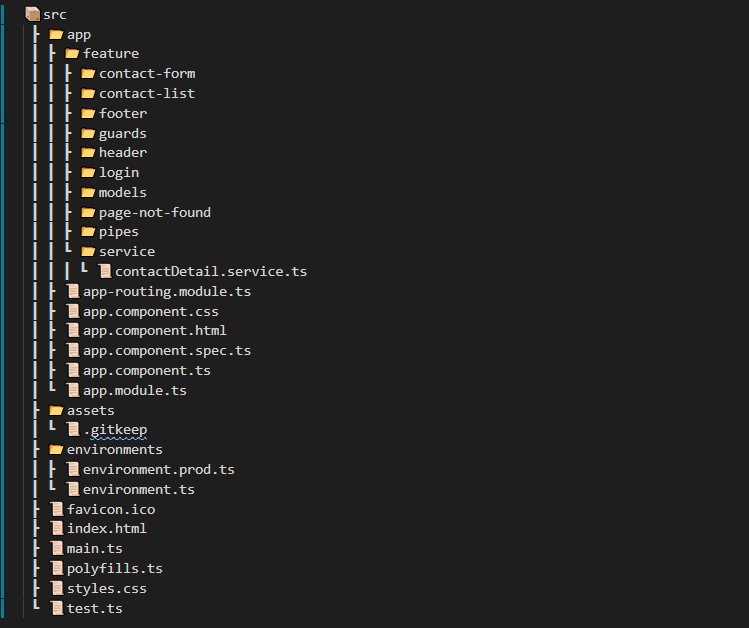

# Login Details 
- Email : ratan@test.com
- Password : 12345

# Instructions on how to run the application.

This project was generated with [Angular CLI](https://github.com/angular/angular-cli) version 8.3.12.

## Development server

Run `ng serve` for a dev server. Navigate to `http://localhost:4200/`. The app will automatically reload if you change any of the source files.

## Code scaffolding

Run `ng generate component component-name` to generate a new component. You can also use `ng generate directive|pipe|service|class|guard|interface|enum|module`.

## Build

Run `ng build` to build the project. The build artifacts will be stored in the `dist/` directory. Use the `--prod` flag for a production build.

## Running unit tests

Run `ng test` to execute the unit tests via [Karma](https://karma-runner.github.io).

## Running end-to-end tests

Run `ng e2e` to execute the end-to-end tests via [Protractor](http://www.protractortest.org/).

## Further help

To get more help on the Angular CLI use `ng help` or go check out the [Angular CLI README](https://github.com/angular/angular-cli/blob/master/README.md).

# Git Path
To clone Project (https://github.com/RatanKumar678/ProductCatalog-)

# Data
❖ Product
➢ id (unique identifier)
➢ name (string, Mandatory field)
➢ price (number, Mandatory field)
➢ category_id (string, Mandatory field)
➢ upvote_count (number, default: 0)
➢ downvote_count (number, default: 0)
➢ trend_score (number)
■ calculated as “(upvote_count / (upvote_count+downvote_count)) *100”
■ Note: if both upvote and downvote counts are zero, then we will consider trend_score to be zero.

❖ Category
➢ Categories data
■ id: ‘1’, name: ‘PII
■ id: ‘2’, name: ‘Level 0’
■ id: ‘3’, name: ‘Level 1’
■ id: ‘4’, name: ‘Public’

➢ Categories data is not editable

# Requirements

1. The app should contain three pages each with its own route
a. Products page: View showing list of all products segregated/filtered as per
their category.
b. Add new product page: View to add a new product
c. Edit product page: View to edit details of an existing product

2. Products page
a. Left sidenav
i. Shows list of all categories
ii. By default, “All” will be selected
iii. When the user clicks on any category in the sidenav, then products
shown should accordingly get filtered. If “All” is selected, then all
products will be displayed.

b. List of products
i. The right view of this page has a table with columns:
“name”, “price”, “category”, “Trend score”, “Actions”
i. The table will always be sorted based on “name” ascending
ii. There will be two CTAs “upvote” and “downvote” on actual product
rows
1. upvote button increments the upvote_count of the product
2. downvote button increments the downvote_count of the
product

c. “Add new product” CTA redirects to “Add new product” page
d. Clicking on the product name, opens the ‘Edit product’ for that product.

3. Add new product page
a. Contains a “Visit Products” CTA, which redirects back to “Products page”
b. Contains a form to add a new product
i. Create a simple reactive form that allows the user to add a new
product
ii. The form contains fields: Name, Price and category
iii. Category field will be simple dropdown
iv. Product upon getting added should get a unique id, to be used as a
reference later.
v. The user submits the form using a “Create” CTA
vi. The user should get redirected back to “Products page” once the
submission is successful

4. ‘Edit product’ page

a. Contains a “Visit products” CTA, which redirects back to “Products page”
b. Contains a form to edit the product
i. Create a simple reactive form that allows the user to edit the product
ii. The form contains fields: Name, Price, and category
iii. Category field will be simple dropdown
iv. The user submits the form using a “Save” CTA.
v. The user should get redirected back to “Products page” once the
submission is successful

# Designs Pages
1. Products page
2. ‘Add new product’ page
3. ‘Edit product’ page

# Optional
1. List of products should be preserved even if the page is reloaded. (note: There will
not be a product deletion flow, so the products dataset keeps growing)

2. Add ‘tags’ field to product form (both add and edit).
a. tags field will be an array of strings. It will be an optional field.
b. Form should contain an ‘Add Tag’ button. When the user clicks on the add
button, an input field should be shown where the user can enter the tag
name.
c. Users can add any number of tags.
d. Users can delete the already added tags.
e. note: We will not show tags on products page, users can see them while
editing the product.

# Directory structure
CatalogApp

